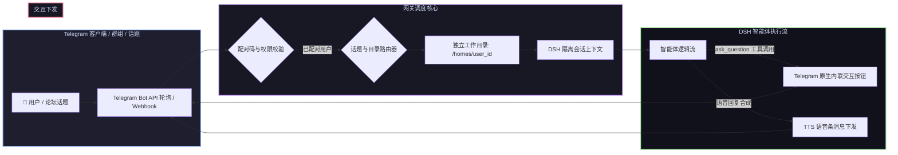

# 📦 @goodandready/dsh-messenger-gateway

> ## 🔱 獨立 fork(本專案)
>
> 本專案是 [`GooDAnDReaDY/dsh-messenger-gateway`](https://github.com/GooDAnDReaDY/dsh-messenger-gateway)(MIT)的
> **獨立 fork**,基於 **0.4.9**,並針對 **DeepSeek Harness `0.2.0-rc.2`** 開發。
>
> * **不追蹤上游**:不合併上游,且**刻意停用**內建的 npm 自更新(安裝上游版本會覆蓋本專案並悄悄還原所有修正)。
>   更新請在插件目錄執行 `git pull`。
> * 相對 0.4.9 新增:**工作區話題鏡射**、**每個聊天/話題固定一個 session**、**排隊回合(每則訊息各自回覆)**,
>   以及六項 DSH 0.2.0-rc.2 相容性修正。
> * 症狀 → 根因 → 修法、診斷工具與維護流程:**[LOCAL-FIXES.md](LOCAL-FIXES.md)**
>
> ```bash
> git clone https://github.com/tzunghsi-beefamily/dsh-messenger-gateway
> dsh plugin --profile web add /path/to/dsh-messenger-gateway
> ```
>
> 原始插件與設計:GooDAnDReaDY(MIT,見 [LICENSE](LICENSE))

<div align="center">

<h3>DeepSeek Harness Telegram 专属网关（支持交互按钮调度、论坛话题隔离与语音条回复）</h3>

<p align="center">
  <a href="https://github.com/tzunghsi-beefamily/dsh-messenger-gateway"></a>
  <a href="LICENSE"></a>
  <a href="https://github.com/topics/dsh-plugin"></a>
  <a href="https://nodejs.org"></a>
</p>

<p align="center">
  <a href="https://goodandready.app/"></a>
</p>

<p align="center">
  <a href="README.md"><b>🇬🇧 English</b></a> •
  <a href="README.ru.md"><b>🇷🇺 Русский</b></a> •
  <a href="README.zh.md"><b>🇨🇳 中文说明</b></a>
</p>

<table align="center">
  <tr>
    <td align="center">
      🐛 <strong>本 fork 的問題回報</strong>:請開在
      <a href="https://github.com/tzunghsi-beefamily/dsh-messenger-gateway/issues">這個 repository</a>。
      <br><br>
      🙏 <strong>上游專案</strong>:原始插件很優秀,也請給
      <a href="https://github.com/GooDAnDReaDY/dsh-messenger-gateway">GooDAnDReaDY/dsh-messenger-gateway</a> 一顆星。
    </td>
  </tr>
</table>

</div>

---

## ⚡ 插件概览

**`dsh-messenger-gateway`** 为 **DeepSeek Harness** 智能体提供企业级 Telegram 接入桥梁。

除常规对话转发外，本插件全面打通了智能体深度交互能力：**问答交互式内联按钮 (Inline Keyboard)**、**Telegram 论坛话题 (Forum Topics) 独立会话隔离**、**单用户工作区目录安全隔离**、**6 位配对码鉴权防护**以及**语音条朗读回复 (TTS)**。



---

## 🔱 本 fork 專屬:工作區話題

本 fork 會把 **DSH 的工作區清單(workspace registry)鏡射成 Telegram 論壇話題** —— 一個工作區一個話題。
在話題裡說話,agent 就會在**該工作區的目錄**執行,產生的 session 也會出現在 Web GUI **對應的專案**底下
(手機發起 → 桌機接手)。

| 指令 | 說明 |
|------|------|
| `/ws sync` | 讓話題與工作區一致(新建 / 改名 / 關閉),每個間隔 1.5 秒,429 會重試一次 |
| `/ws list` | 顯示「工作區 ↔ 話題」對照表 |
| `/ws probe` | 建一個測試話題並印出 Bot API 原始回應(診斷用) |
| `/ws reset` | 清空對照表但保留論壇(刪過話題、或關閉過「話題」功能後使用) |
| `/ws` | 顯示你所在話題對應的工作區 |

前置:**已開啟「話題」的超級群組**、bot 為管理員且具 **Manage Topics** 權限,然後在 `General` 打一次
`/ws sync`。之後在 GUI 新增工作區時要再打一次(背景自動同步預設關閉)。
設定在 `telegram.workspaceTopics`:`enabled`、`forumChatId`、`closeOnRemove`、`autoReconcile`(預設 `false`)、
`createDelayMs`(預設 `1500`)。

每個聊天/話題**固定一個 session**,直到你打 `/new`(綁定檔 `~/.dsh/messenger-gateway/chat-sessions.json`)。
回合進行中收到的訊息會**排隊**,一則一則各別回覆;要回原版行為設 `telegram.queueWhileBusy: false`。

### 預設 session 與接續 session

每個聊天/話題都有一個**預設 session**(第一次從 Telegram 發話時建立,重啟後仍會接續)。
在此之上,你可以**接續任何既有 session**(例如你在 Web GUI 開的那條),直接從 Telegram 繼續做:

| 指令 | 作用 |
|------|------|
| `/sessions [n] [all] [sub]` | 列出**這個話題所屬工作區**的 session 與 id(`all` = 所有工作區,`sub` = 含子 agent) |
| `/attach <編號\|id 前幾碼\|標題片段>` | 接續該 session;這個話題的預設 session 會被保留 |
| `/detach`(別名 `/back`、`/default`) | 退出接續的 session,回到預設 session |
| `/new` | 兩者都清掉:下一則訊息建立全新的預設 session |

`/status` 會顯示 `mode: default` 或 `mode: attached → <session id>`。綁定檔格式是
`{"defaultSessionId": "msgw-…", "attachedSessionId": "session-…"}`(舊版只存一個 id 的檔案會自動遷移)。
**`/sessions` 以工作區為範圍**:在「雜七雜八」話題只會列出該工作區的 session,不會混到別的專案;
要跨工作區看用 `/sessions all`。
**General 是一般對話,不屬於任何工作區**:沒有工作區綁定的聊天會使用自己的目錄
(`agent.generalCwd`,預設 `C:\Users\DavidYeh\Documents\Telegram`),不是主機的啟動目錄 —— 這樣檔案沙盒範圍小
(不會因為工作區是家目錄而一直跟你要權限),在 GUI 也顯示為「未歸屬」;它跟其他聊天一樣有自己的預設 session。
**子 agent 的 session 預設會被隱藏。** agent 開子 agent 時,那些 session 也會被存下來(`delegationDepth > 0`),
但它們只是上層 session 的活動,所以 `/sessions`、`npm run sessions`、`/attach` 預設都會跳過;要看請用
`/sessions sub`(或 `--all`),而 `/attach` 會拒絕接續子 agent 的 session。

### 🗑️ 刪除 session

DSH 本身**只有封存**:GUI 提供 archive/unarchive(`delete` 只給工作區),而 JSONL 持久化後端沒有任何清除功能。
session 就是磁碟上的一個資料夾,所以本 fork 提供安全工具:

```bash
npm run session:delete -- --id 48c35e00 --dry-run      # 先看會做什麼(不動檔案)
npm run session:delete -- --id 48c35e00                # 移到 ~/.dsh/session-trash(可還原)
npm run session:delete -- --id 48c35e00 --purge --yes  # 永久刪除
```

它會一起處理 `~/.dsh/sessions/<工作區slug>/<id>/` 與投影快取檔;若 DSH 正在執行、或 Telegram 還綁著該 session,
會先警告;查詢符合多筆時會要求更精確的 id 前幾碼。`workspace.json` 裡殘留的 id 無害 —— registry 會濾掉找不到路徑的
id,所以 GUI 清單也會一起消失(若沒立刻更新,重啟 DSH 即可)。

## 🩺 健康檢查與測試

```bash
npm test        # 離線測試:話題鏡射 15 項 + session 綁定 17 項(不需要 bot 或 DSH)
npm run health  # 一鍵健康檢查 —— 每次更新 DSH 之後跑這個
npm run sessions  # 列出所有 session 的 id / 標題 / 專案
```

`tools/health-check.mjs` 會檢查檔案、`lib/` 全部語法、**每一項本 fork 修正是否還在**、狀態檔
(`workspace-topics.json`、`chat-sessions.json`、`events.log`)與執行中的外掛端點,最後跑一次測試。
`tools/read-session.mjs <session.v4.jsonl.zstd>` 可印出 DSH session 紀錄(zstd 多 frame)。

## 🧯 疑難排解

完整「症狀 → 根因 → 修法」在 **[LOCAL-FIXES.md](LOCAL-FIXES.md)**。速查:

| 症狀 | 可能原因 |
|------|----------|
| GUI 有回答,Telegram 卻顯示 `(no response)` | 回合結束後才收到事件,或回合中 Gateway 被重建(看 `events.log` 的 `gateway.stopped`) |
| `Internal error: session "…" already exists` | 既有 session 被丟給 `agents.create()`,應該用 `agents.resume()` |
| 每則訊息都開新 session | `chat-sessions.json` 不存在或被清掉(或用了 `/new`) |
| 回覆跑到別的對話 | `/status` 顯示 `mode: attached` —— 打 `/detach` 回到預設 session |
| 設定卡存不了、token 消失 | 設定區塊少了 `.volatile()` 標記(DSH 0.2.0-rc.2 只持久化 volatile 欄位) |
| 同名話題重複出現 | 失敗後又按了一次 `/ws sync` —— 先 `/ws reset` 再打一次 `/ws sync` |

## 📦 安裝指南

```bash
git clone https://github.com/tzunghsi-beefamily/dsh-messenger-gateway
dsh plugin --profile web add /path/to/dsh-messenger-gateway
```

(不要用 `dsh plugin update`,也**不要**安裝上游的 npm 版本 —— 會覆蓋本 fork 的修正。)

---

## 📄 開源授權

MIT © 原始作者 [GooDAnDReaDY](https://github.com/GooDAnDReaDY);本 fork 由
[tzunghsi-beefamily](https://github.com/tzunghsi-beefamily) 維護(獨立專案,不追蹤上游)。
